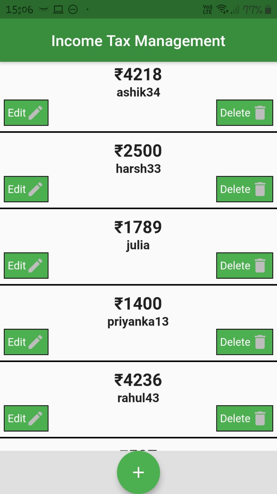
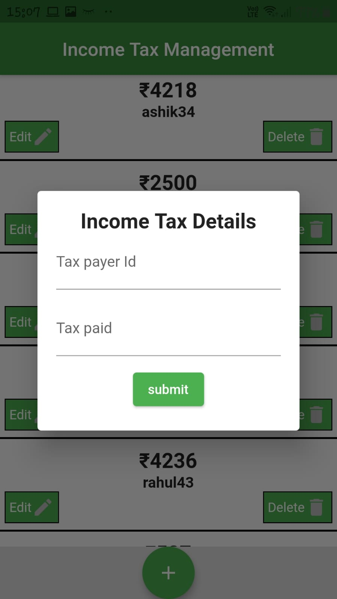
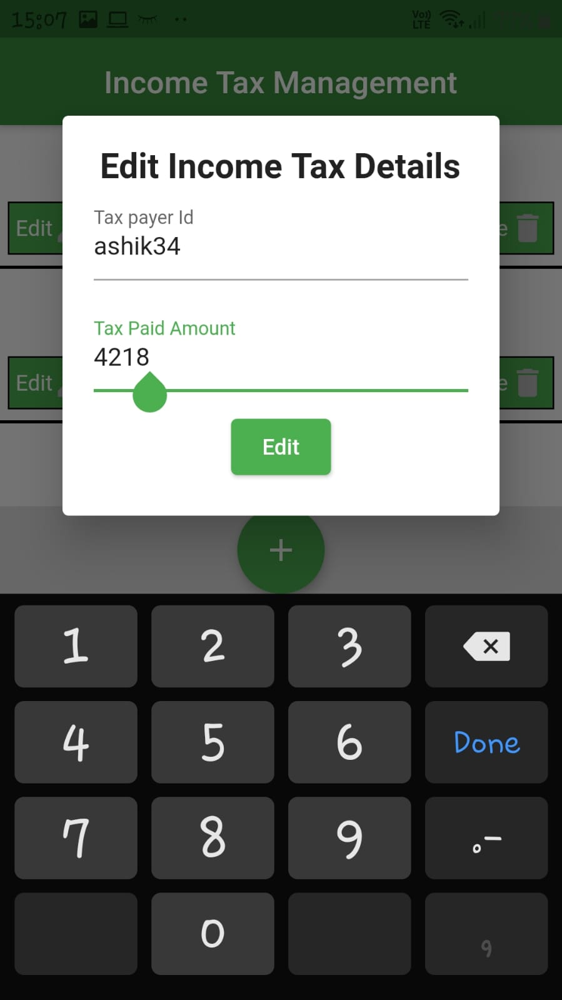
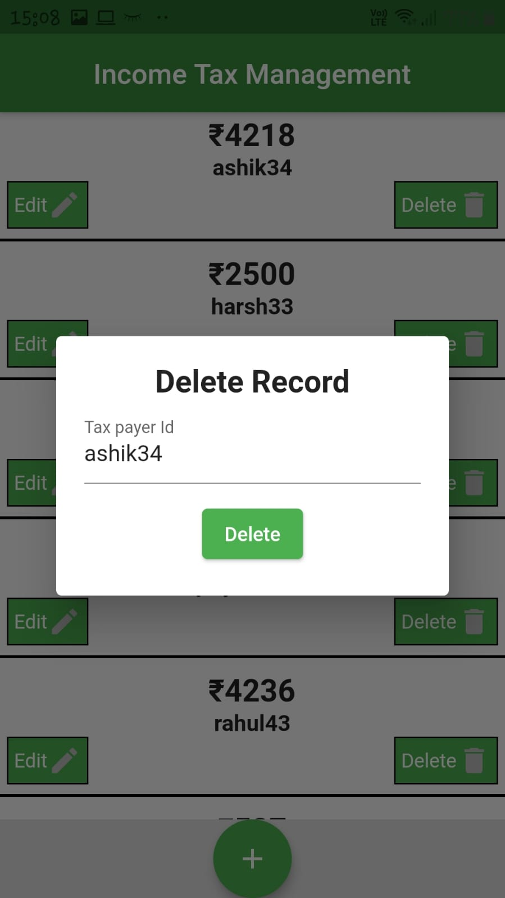

# BasicHive
The app uses Hive to do CRUD(Create Read Update Delete) operations. You can insert, update and delete data, the data is persisted in the app and no internet is required to do so.

 

  

## Getting Started
You can build apps with Flutter using any text editor combined with our command-line tools. However, I recommend using one of Flutter's editor plugins for an even better experience. These plugins provide you with code completion, syntax highlighting, widget editing assists, run & debug support, and more.

## Prerequisites
Things you need to install:
1. Flutter sdk
2. Android Studio/VS Code (IDE)

For more info head towards https://flutter.dev/docs/get-started/install 

## Built With
1. Flutter - The sdk used
2. VS Code - IDE used
3. Android Studio - Android sdk

## Packages used
1. hive
2. path_provider
3. hive_flutter
4. flutter_launcher_icons (for app icon)
5. flutter_native_splash (for splash screen)

## Authors
Souvik Banerjee

### Acknowledgments
Thanks to all whose codes were used.

